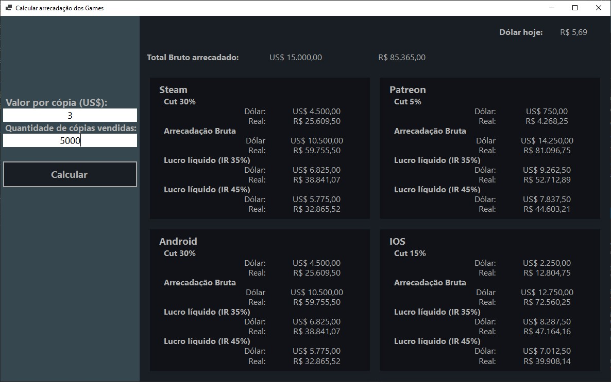

# CalculaVendaGames

Um projeto Windows Forms simples com Forms inseridos dinamicamente,
MultiThreading e WebScraping

[Download](https://github.com/Victoralm/CalculaVendaGames/releases/download/1.0.0/v1.0.0.zip)

<!--  -->

## Features

-   ### MultiThread (Tasks):

    -   Método WebScraping assíncrono usado para obter o valor de conversão de Dólar para Real.
    -   Inserção dinâmica de Form secundário nas 4 células de um Tablepanel do Form principal
    -   Alteração dinâmica dos textos, dos controls das cópias inseridas do Form
        secundário, para seus respectivos valores iniciais
    -   Método que calcula e preenche os controls de resultado, nas cópias inseridas
        do Form secundário, também faz uso de Task

-   ### Validação de TextBoxes:
    -   Ambos os controls de entrada validam seus valores quando perdem o foco
